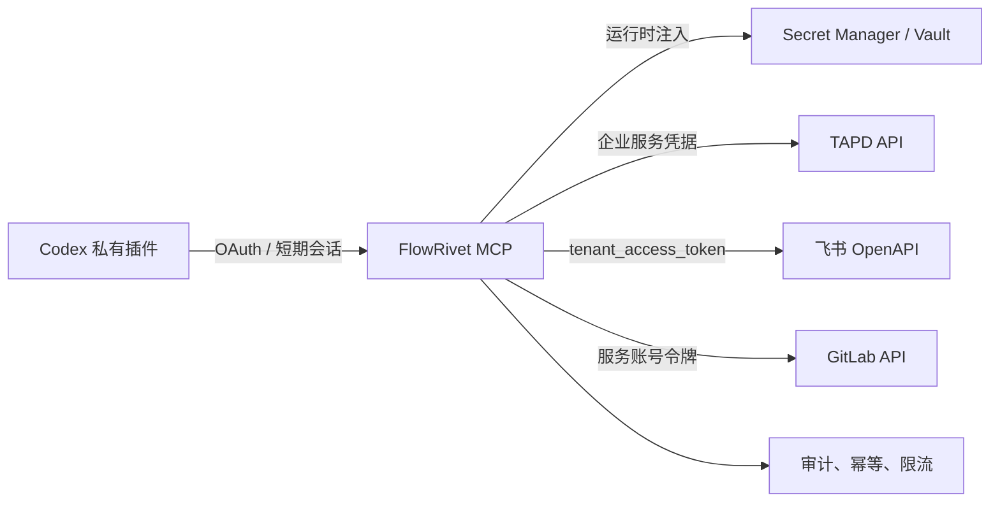

# FlowRivet 凭据安全边界

## 结论

正式环境中的 TAPD 企业 API 密码、飞书 App Secret 和 GitLab 服务账号凭据必须保存在远程 FlowRivet MCP 的 Secret Manager 中。Codex 插件和本地 CLI 不保存、不读取这些企业级长期凭据。

## 凭据分层

| 凭据 | 保存位置 | Codex 是否可见 | 建议生命周期 |
|---|---|---|---|
| TAPD 企业 API 密码 | Secret Manager | 否 | 定期轮换 |
| 飞书 App Secret | Secret Manager | 否 | 定期轮换 |
| GitLab 服务账号令牌 | Secret Manager | 否 | 短期或定期轮换 |
| FlowRivet MCP 会话 | 系统凭据存储或 OAuth 会话 | 仅短期令牌 | 小时级 |
| TAPD 用户身份绑定 | MCP 加密数据库 | 否 | 可撤销 |
| 飞书用户身份绑定 | MCP 加密数据库 | 否 | 可撤销 |

## MCP 服务必须实现的控制

1. 使用工作负载身份读取 Secret Manager，禁止把密钥写入镜像、仓库、日志或 MCP 响应。
2. 对每个工具声明最小权限，例如需求只读、沙箱写入、测试群通知分别授权。
3. 所有写操作记录操作者、目标、请求幂等键和结果，敏感字段统一脱敏。
4. 生产项目、正式群和受保护分支默认拒绝写入，需要显式策略放行。
5. 飞书 `tenant_access_token` 只在服务内存中缓存，并在过期前刷新，不落盘。
6. Codex 通过企业 SSO/OAuth 连接 MCP，服务端再执行用户与 TAPD、飞书、GitLab 身份映射。
7. 内网 GitLab 仓库映射以 TAPD 项目配置为准；FlowRivet 自身的 GitHub `origin` 不参与业务项目识别。

## 本地 POC 边界

当前 CLI 支持从 Windows 用户环境变量读取凭据，只用于验证 API 可达性和接口契约。它不是正式插件的凭据方案。本地 POC 结束并完成远程 MCP 部署后，应删除用户环境中的 `TAPD_API_PASSWORD` 和 `FEISHU_APP_SECRET`，随后轮换相关长期凭据。
