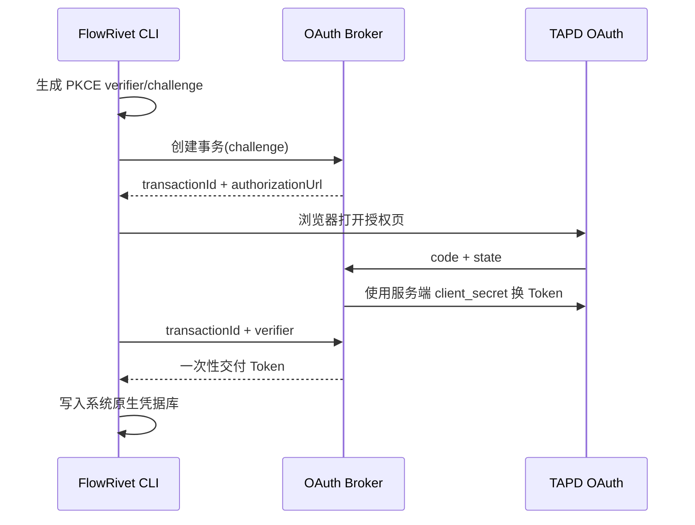

# TAPD OAuth Broker 架构

## 职责边界

OAuth Broker 只负责创建五分钟授权事务、交换 TAPD 授权码以及向发起事务的 CLI 一次性交付用户 Access Token。它不代理 TAPD 业务 API，不保存飞书或 GitLab 凭据，也不建立第二套项目权限。



## 安全约束

- `client_secret` 只从 Broker 进程环境或部署平台 Secret 注入，禁止进入仓库、CLI、URL和日志。
- 生产回调必须为精确 HTTPS URL，不允许通配符；仅本机开发允许 `127.0.0.1`。
- `state` 使用 256 位随机数并在回调时校验，事务五分钟后失效。
- TAPD 不支持客户端 PKCE，因此 FlowRivet 使用 PKCE challenge 保护 Broker 到 CLI 的一次性交付。
- Token 只存在于待兑换事务内存中；成功兑换后立即清除，重复兑换失败。
- 用户态 OAuth 返回 `user_id + company_id` 资源。可通过 `expectedCompanyId` 把事务约束到预期企业；资源不一致时拒绝交付。项目访问范围继续由该用户在 TAPD 内的项目权限决定。
- 服务不得记录请求体、Authorization 头、授权码、state、应用密钥或 Token。

当前实现是单实例内存存储。生产多副本部署前必须改为具备 TTL 和原子领取语义的加密共享存储，或固定单副本并明确不可用风险。

## 结构化日志

Broker 使用 Pino 向 stdout 输出单行 JSON，由本地终端、容器或部署平台负责采集。默认日志级别为 `info`，可通过 `FLOWRIVET_LOG_LEVEL=debug|info|warn|error` 调整；其他值会阻止服务启动。

服务成功监听后输出启动事件：

```json
{"level":30,"event":"broker.started","host":"127.0.0.1","port":43119,"callbackPath":"/oauth/callback","scopes":["user","story#read","workspace#read"]}
```

每个 HTTP 响应都包含 `x-request-id`。调用方可以传入 8 到 128 位的字母、数字、点、下划线或短横线作为 requestId；缺失或非法时由 Broker 生成 UUID。排障时用响应头中的值查询 `http.request.completed`、`http.request.rejected` 和对应 OAuth 事件：

```json
{"level":30,"event":"http.request.completed","requestId":"support-request-001","method":"GET","path":"/missing","statusCode":404,"durationMs":2}
```

OAuth 的创建、回调和兑换是不同 HTTP 请求，各自拥有 requestId。三阶段通过不可逆的 `transactionRef` 串联。日志只记录路径，不记录查询参数、请求体、Authorization、应用 Secret、授权码、state、PKCE 数据、真实 transaction ID 或 Token。Pino redact 是最后一道保护，业务代码仍必须遵循白名单字段记录原则。
