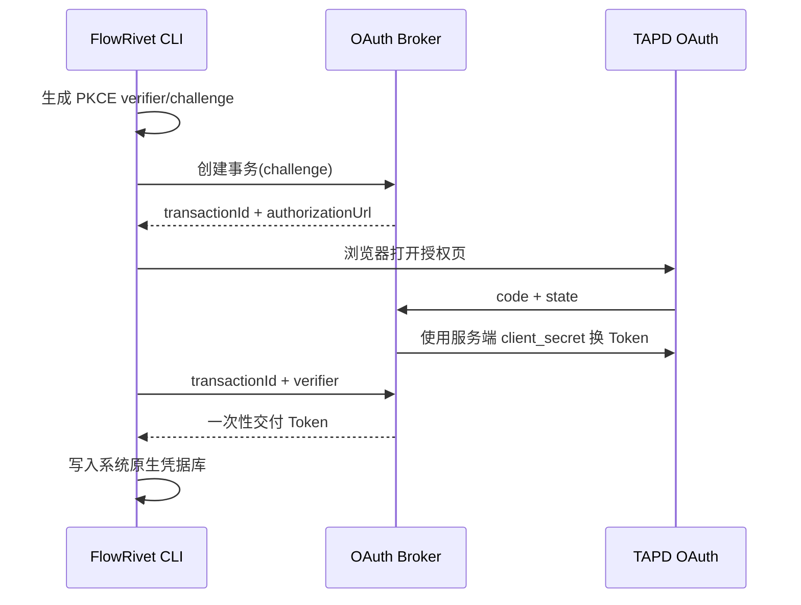

# TAPD OAuth Broker 架构

## 职责边界

OAuth Broker 只负责创建五分钟授权事务、交换 TAPD 授权码以及向发起事务的 CLI 一次性交付用户 Access Token。它不代理 TAPD 业务 API，不保存飞书或 GitLab 凭据，也不建立第二套项目权限。

## 安全约束

- `client_secret` 只从 Broker 进程环境或部署平台 Secret 注入，禁止进入仓库、CLI、URL和日志。
- 生产回调必须为精确 HTTPS URL，不允许通配符；仅本机开发允许 `127.0.0.1`。
- `state` 使用 256 位随机数并在回调时校验，事务五分钟后失效。
- TAPD 不支持客户端 PKCE，因此 FlowRivet 使用 PKCE challenge 保护 Broker 到 CLI 的一次性交付。
- Token 只存在于待兑换事务内存中；成功兑换后立即清除，重复兑换失败。
- 用户态 OAuth 返回 `user_id + company_id` 资源。可通过 `expectedCompanyId` 把事务约束到预期企业；资源不一致时拒绝交付。项目访问范围继续由该用户在 TAPD 内的项目权限决定。
- 服务不得记录请求体、Authorization 头、授权码、state、应用密钥或 Token。

当前实现是单实例内存存储。生产多副本部署前必须改为具备 TTL 和原子领取语义的加密共享存储，或固定单副本并明确不可用风险。
