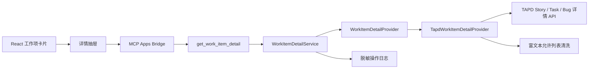

# 工作项详情抽屉设计规格

## 1. 背景

FlowRivet Phase 1C 已能通过本地 Companion 聚合当前用户在全部可访问项目中的真实需求、任务和缺陷，并在 Codex 看板中只读展示。当前卡片只包含适合扫描的摘要字段，用户必须跳转 TAPD 才能查看描述、人员和时间信息。

本阶段为看板增加按需加载的工作项详情抽屉。实现继续保持只读，并延续 Provider 中立边界，以便后续接入其他项目管理系统。

本规格补充 [TAPD 我的待办看板设计](./2026-08-06-tapd-my-work-taskboard-design.md) 中“点击卡片打开右侧详情抽屉”的要求。

## 2. 目标

- 点击工作项卡片即可在看板内查看核心详情和描述。
- 详情在点击后通过原项目管理 Provider 实时读取，不扩大看板列表快照。
- 桌面端保持看板滚动位置，移动端提供可读的全屏详情体验。
- 安全展示 TAPD 富文本描述，不执行或加载不受信任内容。
- 详情失败只影响当前抽屉，不影响看板及其他工作项。
- 保持 Provider 中立、只读、日志脱敏和本机凭据边界。

## 3. 非目标

- 不编辑标题、描述、负责人、状态或其他 TAPD 字段。
- 不提供评论、附件上传、工作流流转或拖拽回写。
- 不落盘缓存工作项详情。
- 不展示附件、图片、iframe、表单或 TAPD 自定义组件。
- 不在本阶段接入 GitLab、飞书或其他项目管理 Provider。
- 不实现完整 TAPD 字段镜像；迭代、分类、父需求、参与人等留待后续验证。

## 4. 已确认决策

| 决策点 | 结论 |
| --- | --- |
| 数据加载 | 点击卡片后实时读取详情 |
| 字段范围 | 核心信息、人员、时间、描述和原系统链接 |
| 富文本 | Companion 侧安全清洗后保留基础格式 |
| 桌面布局 | 右侧覆盖式抽屉，不推挤看板 |
| 移动布局 | 全屏详情层 |
| 缓存 | 当前 UI 会话内按稳定 key 缓存；看板刷新时清空 |
| 卡片交互 | 整张卡片打开详情；原系统链接移至抽屉 |
| 架构 | Provider 中立详情端口和统一详情契约 |

## 5. 架构



### 5.1 Provider 中立契约

新增独立的详情契约，不把详情字段塞入列表 `WorkItem`：

```ts
type WorkItemDetailRef = {
  key: string;
  providerId: string;
  projectExternalId: string;
  providerItemType: string;
  externalId: string;
};

type WorkItemDetail = WorkItemDetailRef & {
  projectName: string;
  kind: WorkItemKind;
  title: string;
  providerStatus: string;
  priority?: string;
  assignees: string[];
  creator?: string;
  createdAt?: string;
  updatedAt?: string;
  dueAt?: string;
  completedAt?: string;
  sanitizedDescriptionHtml?: string;
  externalUrl: string;
};
```

所有字段使用通用语义。TAPD 的 `Story`、`Task`、`Bug` 包装和专属字段名只存在于 TAPD Adapter。

### 5.2 详情服务

`WorkItemDetailService` 根据 `providerId` 选择 Provider，验证引用字段并归一化错误。服务不落盘、不跨用户缓存，也不参与多项目聚合同步。

第一阶段只注册 TAPD Provider，但路由和契约允许后续新增其他 Provider。未知 Provider 返回稳定的 `work_item_detail_unsupported`。

详情工具仍受“我的待办”范围约束：请求项目必须存在于当前账号自动发现且可用的项目目录中；Provider 返回的负责人必须精确包含当前登录身份。只具有项目读取权限但未分配给当前用户的工作项不得通过该工具读取详情。

### 5.3 TAPD Adapter

TAPD Adapter 根据 `providerItemType` 使用对应详情端点：

- `story`：读取需求详情。
- `task`：读取任务详情。
- `bug`：读取缺陷详情。

请求只使用本机安全存储解析出的个人 Token。详情响应必须匹配请求的项目和工作项标识；缺少稳定 ID 或标题视为响应格式异常，不向 UI 返回半结构化原始对象。

`providerItemType` 使用固定允许值 `story`、`task`、`bug` 路由，不允许将任意字符串拼接为请求路径。负责人继续按分号拆分、去空格后精确匹配当前身份，不做包含匹配。

## 6. MCP 工具

新增只读工具：

```text
get_work_item_detail({
  providerId,
  projectExternalId,
  providerItemType,
  externalId
})
```

工具声明 `readOnlyHint: true`、`destructiveHint: false`、`idempotentHint: true`。返回值必须通过统一 `WorkItemDetail` Schema，不接受 URL、Token、标题或描述作为输入。

工具只读取一条详情。看板刷新继续调用 `refresh_my_work_items`，不会预取全部详情。

## 7. UI 与交互

### 7.1 桌面端

- 抽屉从右侧覆盖，宽度为 `min(520px, 42vw)`。
- 背景使用轻量遮罩；看板不重新排版、不改变横向滚动位置。
- 抽屉内部独立纵向滚动。
- 底部固定“刷新详情”和“在 TAPD 打开”操作。

### 7.2 移动端

- `520px` 及以下使用全屏详情层。
- 顶部提供返回/关闭按钮，内容区域占完整宽度。
- 不保留不可读的窄看板预览。

### 7.3 内容结构

1. 类型、外部 ID、关闭按钮。
2. 标题、原始状态。
3. 项目、优先级、负责人、创建人。
4. 创建、更新、截止、完成时间。
5. 描述。
6. 固定底部操作。

缺失字段不显示空占位。日期沿用当前中文日期格式，并保留完整值供辅助信息读取。

### 7.4 卡片与键盘

- 整张卡片成为可聚焦按钮语义，点击、`Enter` 或 `Space` 打开详情。
- 卡片标题不再直接跳转 TAPD。
- 打开后焦点进入关闭按钮。
- `Esc`、遮罩点击或关闭按钮关闭抽屉。
- 关闭后焦点返回触发卡片。
- 项目过滤导致当前工作项不可见时关闭抽屉。
- 打开其他卡片时复用抽屉并读取对应详情。

## 8. 会话缓存

UI 使用工作项稳定 `key` 保存内存缓存：

- 首次打开显示骨架并实时读取。
- 同一会话再次打开立即显示缓存。
- 用户点击“刷新详情”时绕过缓存。
- 看板整体刷新成功后清空全部详情缓存。
- 登录、断开、Token 失效或账号切换时清空缓存并关闭抽屉。
- 缓存不写入文件、浏览器持久存储或 MCP Server。

## 9. 富文本安全

清洗发生在 Companion 侧，UI 只接收受控 HTML。

允许元素：`p`、`br`、`ul`、`ol`、`li`、`strong`、`em`、`code`、`pre`、`a`。

规则：

- 删除 `script`、`style`、`iframe`、`img`、`form` 和未知元素。
- 删除所有事件属性、内联样式、`id`、`class` 和 `data-*` 属性。
- 链接只允许绝对 `https` URL。
- 合法链接统一设置 `target="_blank"` 和 `rel="noreferrer"`。
- 删除 `javascript:`、`data:`、`file:`、相对 URL 和畸形 URL。
- 清洗失败时返回纯文本或空描述，不返回原始 HTML。
- 清洗后的描述限制为 256 KiB；超过限制时安全截断并显示内容已截断提示，避免单条详情耗尽 UI 或 MCP 消息资源。

实现应使用成熟 HTML 解析/清洗库，不使用正则表达式处理 HTML。

## 10. 状态与错误

| 场景 | UI 行为 | 稳定错误码 |
| --- | --- | --- |
| 未连接或 Token 失效 | 关闭抽屉并进入登录状态 | `provider_not_connected` / `provider_unauthorized` |
| 无详情读取权限 | 保留抽屉，显示无权限提示 | `work_item_detail_forbidden` |
| 项目不在当前可用目录或工作项不属于当前用户 | 保留抽屉，不返回详情 | `work_item_detail_forbidden` |
| 工作项不存在 | 保留抽屉，提示记录不存在 | `work_item_detail_not_found` |
| TAPD 暂时不可用或超时 | 保留抽屉，显示重试 | `provider_unavailable` |
| 响应格式异常 | 保留抽屉，显示读取失败 | `work_item_detail_invalid_response` |
| 切换卡片时旧请求后返回 | 丢弃旧结果，不覆盖当前详情 | 无 |

每个详情请求必须具备独立 requestId。日志只记录 requestId、工具名、Provider ID、工作项类型、结果、耗时和稳定错误码；禁止记录身份、项目或工作项标识、标题、描述、URL、Token、Authorization 或响应正文。

## 11. 测试策略

### 11.1 合同与 Adapter

- 统一详情 Schema 的必填、可选和未知字段行为。
- Story、Task、Bug 详情端点、包装响应和字段映射。
- 项目/工作项标识不匹配、401、403、404、5xx、超时和异常 JSON。
- HTML 允许元素、危险标签、危险属性、未知协议和畸形嵌套。

### 11.2 MCP Server

- 工具注解和输入校验。
- Provider 路由、成功响应和稳定错误归一化。
- 日志不包含身份或业务明细。
- 不注册任何详情写工具。

### 11.3 React

- 卡片点击和键盘打开。
- 加载骨架、成功内容、失败和重试。
- 会话缓存、详情刷新和看板刷新失效。
- 快速切换卡片时忽略旧请求。
- 关闭方式和焦点恢复。
- 登录状态变化时关闭并清空缓存。

### 11.4 Playwright

- `1440x900` 覆盖式抽屉不改变看板布局。
- `390x844` 使用全屏详情层，无外层溢出。
- `Esc`、遮罩、关闭按钮、键盘打开和外链行为。
- 富文本不执行脚本或加载被禁止资源。

### 11.5 真实只读探针

只记录：请求成功、三类中至少一种详情可读、核心字段存在、描述清洗完成、工具只读。不得输出项目/工作项身份、标题、描述、URL、用户身份、Token 或响应正文。

## 12. 准入与准出

### 准入

- Phase 1C 真实只读看板在 `main` 可运行。
- 本机 TAPD Token 已通过安全存储验证。
- 至少一种真实工作项可用于脱敏探针。
- TAPD 三类详情端点和字段通过合成响应测试约束。

### 准出

- 桌面抽屉和移动全屏详情均可用。
- 三种工作项类型共享 Provider 中立详情契约。
- 描述通过允许列表清洗，攻击用例通过。
- 缓存、刷新、错误、竞态和焦点行为均有自动化覆盖。
- 日志与 MCP 结果不泄露凭据或禁止记录的业务明细。
- 没有新增 TAPD 写请求或写工具。
- 单元、合同、类型检查、构建、Playwright 和真实只读探针全部通过。
